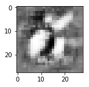
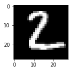
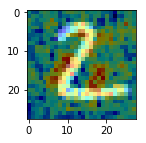
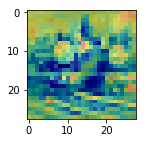

## Keras implementation of AnoGAN 

https://arxiv.org/abs/1703.05921

Abstract

질병의 예후를 모니터링하기 위해 이미지 마커를 잡아내는 모델을 얻는 것은 매우 어려운 일이다. 보통의 모델은 자동 감지를 위해 알려진 마커의 주석이 달린 예제를 사용하여 많은 양의 데이터를 기반으로 한다. 주석처리(라벨링) 작업과 이미 알려진 것들에 대해서만 탐지 가능하다는 점은 그런 방식의 단점을 작용한다 이 논문은 이미지에서 어노말리를 찾기 위해 비지도학습 이용하다. 우리가 제안한 anoGAN은 정상적인 변동성의 다양함(정상 데이텅의 분포)를 학습한 DCGAN과 이미지 공간에서 잠재공간으로의 매핑방식을 기반으로 어노말리 스코어를 계산한다. 새로운 데이터에 적용했을때 모델은 어노말리와 어노말리 스코어를 계산한다. 이 방식을 망막의 광학 단층 촬영 영상에 적용한 결과, 망막 유체 또는 반사성 초점을 포함하는 이미지와 같은 변칙적인 영상(어노말리)을 정확하게 식별함을 확인하였다.


```python
import numpy as np
import matplotlib.pyplot as plt
from keras.datasets import mnist
from tqdm import tqdm
import anogan

(X_train, y_train), (X_test, y_test) = mnist.load_data()
X_train = X_train.astype(np.float32)/255.
X_train = X_train.reshape(60000, 28, 28, 1)


Model_d, Model_g = anogan.train(32, X_train)
```

    Using TensorFlow backend.


    #### discriminator ######
    _________________________________________________________________
    Layer (type)                 Output Shape              Param #   
    =================================================================
    conv2d_1 (Conv2D)            (None, 14, 14, 64)        1664      
    _________________________________________________________________
    leaky_re_lu_1 (LeakyReLU)    (None, 14, 14, 64)        0         
    _________________________________________________________________
    dropout_1 (Dropout)          (None, 14, 14, 64)        0         
    _________________________________________________________________
    conv2d_2 (Conv2D)            (None, 7, 7, 128)         204928    
    _________________________________________________________________
    leaky_re_lu_2 (LeakyReLU)    (None, 7, 7, 128)         0         
    _________________________________________________________________
    dropout_2 (Dropout)          (None, 7, 7, 128)         0         
    _________________________________________________________________
    flatten_1 (Flatten)          (None, 6272)              0         
    _________________________________________________________________
    dense_1 (Dense)              (None, 1)                 6273      
    =================================================================
    Total params: 212,865
    Trainable params: 212,865
    Non-trainable params: 0
    _________________________________________________________________
    #### generator ######
    _________________________________________________________________
    Layer (type)                 Output Shape              Param #   
    =================================================================
    dense_2 (Dense)              (None, 6272)              633472    
    _________________________________________________________________
    leaky_re_lu_3 (LeakyReLU)    (None, 6272)              0         
    _________________________________________________________________
    reshape_1 (Reshape)          (None, 7, 7, 128)         0         
    _________________________________________________________________
    up_sampling2d_1 (UpSampling2 (None, 14, 14, 128)       0         
    _________________________________________________________________
    conv2d_3 (Conv2D)            (None, 14, 14, 64)        204864    
    _________________________________________________________________
    leaky_re_lu_4 (LeakyReLU)    (None, 14, 14, 64)        0         
    _________________________________________________________________
    up_sampling2d_2 (UpSampling2 (None, 28, 28, 64)        0         
    _________________________________________________________________
    conv2d_4 (Conv2D)            (None, 28, 28, 1)         1601      
    =================================================================
    Total params: 839,937
    Trainable params: 839,937
    Non-trainable params: 0
    _________________________________________________________________


      0%|          | 1/200 [11:44<38:56:18, 704.42s/it]


```python
## generate random normal image 

generated_img = anogan.generate(3)
plt.figure(figsize=(2, 2))
plt.imshow(generated_img[0].reshape(28, 28),cmap=plt.cm.gray)
plt.show()
```





```python
## compute anomaly score - sample from test set

X_test = X_test.astype(np.float32)/255.
X_test = X_test.reshape(-1, 28, 28, 1)
test_img = X_test[1]

model = anogan.anomaly_detector()
ano_score, similar_img = anogan.compute_anomaly_score(model, test_img.reshape(1, 28, 28, 1))

plt.figure(figsize=(2, 2))
plt.imshow(test_img.reshape(28,28), cmap=plt.cm.gray)
plt.show()
print("anomaly score : " + str(ano_score))
plt.figure(figsize=(2, 2))
plt.imshow(test_img.reshape(28,28), cmap=plt.cm.gray)
residual  = test_img.reshape(28,28) - similar_img.reshape(28, 28)
plt.imshow(residual, cmap='jet', alpha=.5)
plt.show()
```





    anomaly score : 25.997051239013672





```python
## compute anomaly score - sample from strange image

test_img = plt.imread('assets/test_img.png')
test_img = test_img[:,:,0]

model = anogan.anomaly_detector()
ano_score, similar_img = anogan.compute_anomaly_score(model, test_img.reshape(1, 28, 28, 1))

plt.figure(figsize=(2, 2))
plt.imshow(test_img.reshape(28,28), cmap=plt.cm.gray)
plt.show()
print("anomaly score : " + str(ano_score))
plt.figure(figsize=(2, 2))
plt.imshow(test_img.reshape(28,28), cmap=plt.cm.gray)
residual  = test_img.reshape(28,28) - similar_img.reshape(28, 28)
plt.imshow(residual, cmap='jet', alpha=.5)
plt.show()

```


    anomaly score : 431.6568908691406




